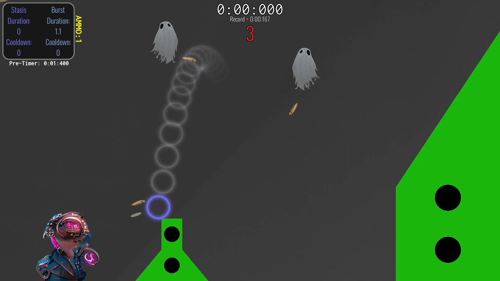
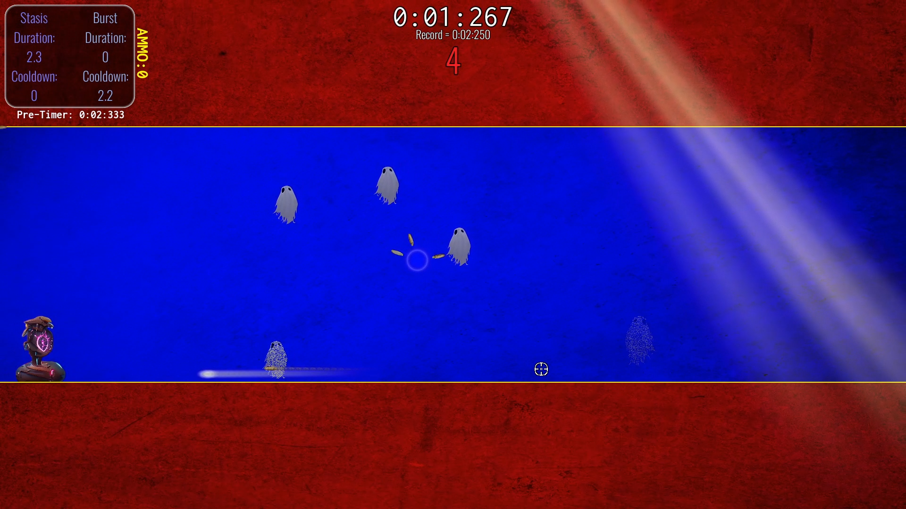
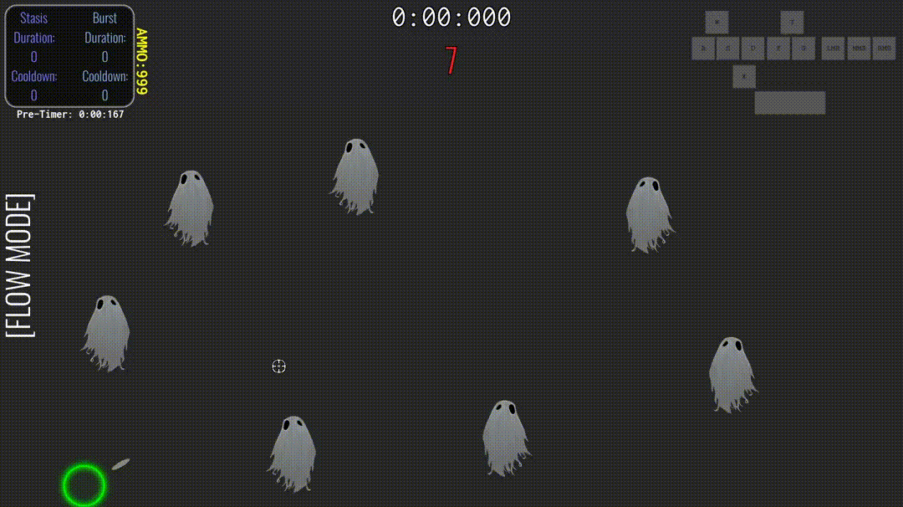

# Tempus Invictus

Tempus Invictus ("Time Undefeated") is a solo-developed passion project of mine that ultimately led to my pursuit of a degree in computer science. This game is a unique, strategic shooter/platformer/speedrunner with time manipulation and a genre-breaking twist: the player chooses the starting conditions of each run. With a near-infinite number of starting conditions for each level, the record for Condition A might be considered a slow run compared to the record for Condition B.

I built this game from scratch, beginning with very limited programming knowledge, and I learned a lot along the way. The concept for this game existed in my head for several years beforehand, so having a working product (that I enjoy playing!) is something that I can talk about for hours. This remains a work in progress that I steadily add to. See the [playable demo](#working-demo) below.

## Table of Contents
- [Engine](#engine)
- [Features](#features)
- [Screenshots and Video](#screenshots-and-video)
- [Working Demo](#working-demo)

## Engine

Godot and GDScript (a Python-like language) were used for the development of this game.

## Features

- Two gameplay modes that drastically alter one's strategic playstyle
- A near-infinite number of starting conditions, leading to limitless replayability
- Clean, unintrusive backgrounds and distinct foregrounds that help the player focus on the task at hand
- Unique enemies that require adaptation to overcome
- Instantaneous level-restart times
- A simple interface to track player progress and records

## Screenshots and Video

To watch a narrated introduction to the game for the explanation of the core mechanics and gameplay loop, visit the YouTube link below:

**https://youtu.be/hFB4NXGmFuY**

Collage of the first 9 levels:

Level screenshot: 

Level screenshot:

Clinical demonstration of Burst ability:

Clinical demonstration of Stasis ability:

## Working Demo

To play a working demo of the game in a web browser -- no downloads required -- visit the link below:

**https://logandrda.itch.io/tempus-invictus-working-demo**

Note that this is an HTML5 version of the game, so certain features may not be available and the performance will be slightly hindered compared to the desktop version of the game.
